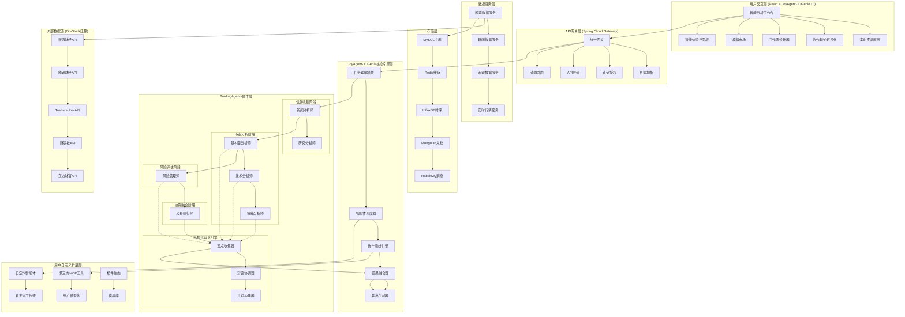

# Stock-Agent 实施路线图

> 基于Go-Stock迁移 + GitHub高星项目对比分析的完整实施方案

## 1. 项目概述

### 1.1 项目目标
将Go-Stock的金融分析能力迁移到Stock-Agent的现代化架构中，同时融合TradingAgents、FinRobot等行业标杆项目的最佳实践，构建业界领先的多智能体金融分析平台。

### 1.2 核心价值主张
- **技术领先**: 基于Spring Boot + React的现代化Web架构
- **AI驱动**: 7个专业金融分析师智能体协作
- **数据丰富**: 多源数据集成（股票、新闻、财报、宏观）
- **实时分析**: 毫秒级数据更新和分析结果推送
- **协作智能**: 结构化辩论和决策融合机制
- **用户定制**: 参照Coze工作流，支持自定义节点和工作流
- **开放生态**: 支持自定义MCP工具和AI模型集成
- **模板复用**: 系统模板+用户自定义，支持工作流复制分享

### 1.3 竞争优势分析

| 对比维度 | Stock-Agent | TradingAgents | FinRobot | Go-Stock | Coze |
|---------|-------------|---------------|----------|----------|------|
| **架构现代化** | ✅ Web + 微服务 | ❌ CLI only | ⚠️ Jupyter | ⚠️ 桌面应用 | ✅ 云原生 |
| **智能体协作** | ✅ 结构化辩论 | ✅ 辩论机制 | ✅ 智能调度 | ❌ 伪协作 | ✅ 工作流 |
| **数据丰富度** | ✅ 多源集成 | ⚠️ 基础数据 | ✅ 多模态 | ✅ 丰富数据 | ⚠️ 通用数据 |
| **实时能力** | ✅ WebSocket | ❌ 无 | ❌ 无 | ✅ 原生绑定 | ✅ 实时响应 |
| **中文市场** | ✅ 本土化 | ❌ 美股为主 | ❌ 通用框架 | ✅ A股专精 | ✅ 中文优化 |
| **用户体验** | ✅ 现代Web | ❌ 命令行 | ⚠️ 技术门槛高 | ✅ 友好界面 | ✅ 极致体验 |
| **自定义能力** | ✅ 工作流+节点 | ❌ 固定角色 | ⚠️ 配置复杂 | ❌ 固定功能 | ✅ 高度自定义 |
| **模型支持** | ✅ 多模型切换 | ⚠️ OpenAI only | ✅ 多模型 | ⚠️ 固定模型 | ✅ 全模型支持 |
| **生态开放性** | ✅ MCP + 插件 | ❌ 封闭系统 | ⚠️ 模块化 | ❌ 封闭系统 | ✅ 开放生态 |
| **金融专业性** | ✅ 深度专业 | ✅ 学术级别 | ⚠️ 通用框架 | ✅ 实战导向 | ❌ 通用平台 |

## 2. 技术架构设计

### 2.1 整体架构图（基于TradingAgents + JoyAgent-JDGenie）



### 2.2 核心技术栈（TradingAgents + JoyAgent-JDGenie融合）

**JoyAgent-JDGenie核心引擎**
```yaml
任务理解层:
  - Spring Boot 3.2+ (主框架)
  - Spring AI (LLM集成)
  - 自然语言处理 (NLP Pipeline)
  - 意图识别引擎

智能体调度层:
  - Spring WebFlux (响应式编程)
  - 自研智能体调度器
  - 任务分解引擎
  - 依赖关系管理

协作编排层:
  - TradingAgents协作协议
  - 结构化辩论引擎
  - 观点融合算法
  - 共识构建机制

输出生成层:
  - 多格式报告生成 (Markdown/HTML/PPT)
  - 实时流式输出
  - 结果可视化引擎
  - 模板渲染系统
```

**TradingAgents协作框架**
```yaml
智能体架构:
  - AbstractFinancialAgent (基础智能体类)
  - AgentRegistry (智能体注册中心)
  - AgentCommunication (智能体通信协议)
  - AgentLifecycle (生命周期管理)

协作机制:
  - StructuredDebate (结构化辩论)
  - ConsensusBuilding (共识构建)
  - ConflictResolution (冲突解决)
  - DecisionFusion (决策融合)

专业分析模块:
  - FundamentalAnalysis (基本面分析)
  - TechnicalAnalysis (技术分析)
  - SentimentAnalysis (情绪分析)
  - RiskAssessment (风险评估)

数据处理:
  - Go-Stock数据迁移适配器
  - 多源数据融合引擎
  - 实时数据流处理
  - 数据质量监控
```

**基础设施技术栈**
```yaml
核心框架:
  - Spring Boot 3.2+ (主框架)
  - Spring WebFlux (响应式编程)
  - Spring Security (安全认证)
  - Spring Cloud Gateway (API网关)

工作流引擎:
  - 自研DAG引擎 (智能体协作专用)
  - Flowable (BPMN工作流引擎)
  - Quartz (任务调度)
  - 事件驱动架构 (Event Sourcing)

数据存储:
  - MySQL 8.0 (主数据库)
  - Redis 7.0 (缓存层)
  - InfluxDB 2.0 (时序数据)
  - MongoDB 7.0 (文档存储)
  - RabbitMQ (消息队列)

AI/ML集成:
  - OpenAI GPT-4/4o (主要LLM)
  - 通义千问 (国产LLM)
  - Claude-3.5 (Anthropic)
  - 文心一言 (百度)
  - LangChain4j (Java LLM框架)
  - Python集成 (复杂算法)

MCP生态:
  - MCP Server SDK (工具集成)
  - 插件管理系统
  - 第三方工具适配器
  - 安全沙箱环境
```

**前端技术栈**
```yaml
核心框架:
  - React 18+ (UI框架)
  - TypeScript 5.0+ (类型安全)
  - Vite (构建工具)
  - React Router (路由)

UI组件:
  - Ant Design 5.0+ (组件库)
  - ECharts 5.0+ (图表库)
  - D3.js (自定义可视化)
  - Framer Motion (动画)
  - React Flow (工作流设计器)

工作流设计:
  - React Flow (节点编辑器)
  - X6 (图形编辑引擎)
  - LogicFlow (流程图库)
  - 自研节点组件库

状态管理:
  - Redux Toolkit (全局状态)
  - React Query (服务端状态)
  - Zustand (轻量状态)
  - Jotai (原子化状态)

实时通信:
  - Socket.IO (WebSocket)
  - Server-Sent Events (SSE)
  - WebRTC (P2P通信)

代码编辑:
  - Monaco Editor (代码编辑器)
  - CodeMirror (轻量编辑器)
  - 语法高亮支持
```

### 2.3 数据架构设计

**数据分层架构**
```
┌─────────────────────────────────────────────────────────────┐
│                    应用数据层                                 │
│  ┌─────────────┐  ┌─────────────┐  ┌─────────────┐        │
│  │ 分析结果缓存 │  │ 用户会话数据 │  │ 实时计算结果 │        │
│  └─────────────┘  └─────────────┘  └─────────────┘        │
└─────────────────────────────────────────────────────────────┘
┌─────────────────────────────────────────────────────────────┐
│                    业务数据层                                 │
│  ┌─────────────┐  ┌─────────────┐  ┌─────────────┐        │
│  │ 股票基础数据 │  │ 财务报表数据 │  │ 新闻舆情数据 │        │
│  └─────────────┘  └─────────────┘  └─────────────┘        │
└─────────────────────────────────────────────────────────────┘
┌─────────────────────────────────────────────────────────────┐
│                    原始数据层                                 │
│  ┌─────────────┐  ┌─────────────┐  ┌─────────────┐        │
│  │ K线时序数据  │  │ 实时行情数据 │  │ 宏观经济数据 │        │
│  └─────────────┘  └─────────────┘  └─────────────┘        │
└─────────────────────────────────────────────────────────────┘
```

## 3. 智能体协作机制设计

### 3.1 TradingAgents协作模型

基于UCLA和MIT的TradingAgents论文，实现结构化辩论和决策融合：

```java
// 协作流程设计
public class AgentCollaborationWorkflow {
    
    public TradingDecision executeCollaborativeAnalysis(String stockCode) {
        // 阶段1: 并行数据收集
        CompletableFuture<NewsAnalysis> newsTask = 
            CompletableFuture.supplyAsync(() -> newsAnalyst.analyze(stockCode));
        CompletableFuture<ResearchReport> researchTask = 
            CompletableFuture.supplyAsync(() -> researchAnalyst.analyze(stockCode));
        
        // 阶段2: 专业分析（基于数据收集结果）
        CompletableFuture.allOf(newsTask, researchTask).join();
        
        List<CompletableFuture<AnalysisResult>> analysisTask = Arrays.asList(
            CompletableFuture.supplyAsync(() -> fundamentalAnalyst.analyze(stockCode)),
            CompletableFuture.supplyAsync(() -> technicalAnalyst.analyze(stockCode)),
            CompletableFuture.supplyAsync(() -> sentimentAnalyst.analyze(stockCode))
        );
        
        // 阶段3: 风险评估
        List<AnalysisResult> analyses = analysisTask.stream()
            .map(CompletableFuture::join)
            .collect(Collectors.toList());
        
        RiskAssessment risk = riskManager.assessRisk(stockCode, analyses);
        
        // 阶段4: 结构化辩论
        DebateResult debate = conductStructuredDebate(analyses, risk);
        
        // 阶段5: 决策融合
        return trader.makeDecision(analyses, risk, debate);
    }
}
```

### 3.2 辩论机制实现

```java
public class StructuredDebateEngine {
    
    public DebateResult conductDebate(List<AnalysisResult> analyses) {
        // 1. 观点分类
        Map<Sentiment, List<AnalysisResult>> groups = groupBySentiment(analyses);
        
        List<DebateRound> rounds = new ArrayList<>();
        
        // 2. 多轮辩论（3轮）
        for (int round = 1; round <= 3; round++) {
            DebateRound debateRound = new DebateRound(round);
            
            // 看多方观点
            if (groups.containsKey(Sentiment.BULLISH)) {
                String bullishArgument = generateArgument(groups.get(Sentiment.BULLISH), round);
                debateRound.addArgument(Sentiment.BULLISH, bullishArgument);
            }
            
            // 看空方观点
            if (groups.containsKey(Sentiment.BEARISH)) {
                String bearishArgument = generateArgument(groups.get(Sentiment.BEARISH), round);
                debateRound.addArgument(Sentiment.BEARISH, bearishArgument);
            }
            
            // 中性方观点
            if (groups.containsKey(Sentiment.NEUTRAL)) {
                String neutralArgument = generateArgument(groups.get(Sentiment.NEUTRAL), round);
                debateRound.addArgument(Sentiment.NEUTRAL, neutralArgument);
            }
            
            // 基于辩论结果更新置信度
            updateConfidenceBasedOnDebate(analyses, debateRound);
            rounds.add(debateRound);
        }
        
        // 3. 构建共识
        Consensus consensus = buildConsensus(rounds, analyses);
        
        return DebateResult.builder()
            .rounds(rounds)
            .consensus(consensus)
            .finalDistribution(calculateFinalDistribution(analyses))
            .build();
    }
}
```

## 4. 数据迁移策略

### 4.1 Go-Stock数据源迁移

**股票数据API迁移**
```java
// 原Go-Stock数据获取逻辑迁移
@Service
public class StockDataMigrationService {
    
    // 新浪财经API迁移
    public StockRealTimeData getSinaRealTimeData(String stockCode) {
        String url = String.format("http://hq.sinajs.cn/list=%s", stockCode);
        String response = restTemplate.getForObject(url, String.class);
        return parseSinaResponse(response);
    }
    
    // 腾讯财经API迁移
    public List<KLineData> getTencentKLineData(String stockCode, String period) {
        String url = String.format("http://web.ifzq.gtimg.cn/appstock/app/fqkline/get?param=%s,%s,,,320,qfq", 
                                  stockCode, period);
        TencentKLineResponse response = restTemplate.getForObject(url, TencentKLineResponse.class);
        return convertToKLineData(response);
    }
    
    // Tushare API迁移
    public FinancialData getTushareFinancialData(String stockCode) {
        TushareRequest request = TushareRequest.builder()
            .apiName("fina_indicator")
            .token(tushareToken)
            .params(Map.of("ts_code", stockCode))
            .build();
        
        TushareResponse response = tushareClient.request(request);
        return convertToFinancialData(response);
    }
}
```

**新闻数据迁移**
```java
@Service
public class NewsDataMigrationService {
    
    // 财联社电报API迁移
    public List<NewsItem> getCailianpressNews(String keyword) {
        String url = "https://www.cailianpress.com/api/news/search";
        
        CailianpressRequest request = CailianpressRequest.builder()
            .keyword(keyword)
            .pageSize(50)
            .build();
        
        CailianpressResponse response = restTemplate.postForObject(url, request, CailianpressResponse.class);
        return convertToNewsItems(response);
    }
    
    // 新闻情绪分析（迁移Go-Stock逻辑）
    public SentimentAnalysis analyzeNewsSentiment(List<NewsItem> news) {
        List<Double> sentimentScores = news.stream()
            .map(this::calculateSentimentScore)
            .collect(Collectors.toList());
        
        return SentimentAnalysis.builder()
            .averageScore(sentimentScores.stream().mapToDouble(Double::doubleValue).average().orElse(0.0))
            .distribution(calculateSentimentDistribution(sentimentScores))
            .trendAnalysis(analyzeSentimentTrend(sentimentScores))
            .build();
    }
}
```

### 4.2 数据库迁移

基于已有的`Database_Migration_Complete.sql`，扩展支持智能体协作数据：

```sql
-- 智能体分析结果表
CREATE TABLE agent_analysis_results (
    id BIGINT PRIMARY KEY AUTO_INCREMENT,
    stock_code VARCHAR(20) NOT NULL,
    agent_type VARCHAR(50) NOT NULL,
    analysis_result JSON NOT NULL,
    confidence_score DECIMAL(5,4),
    reasoning TEXT,
    created_at TIMESTAMP DEFAULT CURRENT_TIMESTAMP,
    INDEX idx_stock_agent (stock_code, agent_type),
    INDEX idx_created_at (created_at)
);

-- 智能体协作记录表
CREATE TABLE agent_collaboration_sessions (
    id BIGINT PRIMARY KEY AUTO_INCREMENT,
    session_id VARCHAR(64) UNIQUE NOT NULL,
    stock_code VARCHAR(20) NOT NULL,
    participant_agents JSON NOT NULL,
    debate_rounds JSON,
    final_decision JSON,
    consensus_level DECIMAL(5,4),
    created_at TIMESTAMP DEFAULT CURRENT_TIMESTAMP,
    completed_at TIMESTAMP,
    INDEX idx_stock_code (stock_code),
    INDEX idx_session_id (session_id)
);

-- 实时分析任务表
CREATE TABLE real_time_analysis_tasks (
    id BIGINT PRIMARY KEY AUTO_INCREMENT,
    task_id VARCHAR(64) UNIQUE NOT NULL,
    stock_code VARCHAR(20) NOT NULL,
    task_type VARCHAR(50) NOT NULL,
    status VARCHAR(20) DEFAULT 'PENDING',
    priority INT DEFAULT 5,
    scheduled_at TIMESTAMP,
    started_at TIMESTAMP,
    completed_at TIMESTAMP,
    result JSON,
    error_message TEXT,
    INDEX idx_status_priority (status, priority),
    INDEX idx_stock_code (stock_code)
);
```

## 5. 实施时间线

### 5.1 第一阶段：基础迁移（4周）

**Week 1-2: 数据层迁移**
- [ ] Go-Stock数据API迁移到Java
- [ ] 数据库设计和迁移脚本
- [ ] 缓存层设计（Redis）
- [ ] 时序数据库集成（InfluxDB）

**Week 3-4: 智能体框架**
- [ ] AbstractFinancialAgent基类设计
- [ ] 智能体注册和管理系统
- [ ] 协作通信协议
- [ ] DAG执行引擎

### 5.2 第二阶段：智能体实现（6周）

**Week 5-6: 核心分析智能体**
- [ ] 基本面分析师Agent
- [ ] 技术分析师Agent
- [ ] 情绪分析师Agent
- [ ] 新闻分析师Agent

**Week 7-8: 高级智能体**
- [ ] 研究分析师Agent
- [ ] 风险管理师Agent
- [ ] 交易执行师Agent

**Week 9-10: 协作机制**
- [ ] 结构化辩论引擎
- [ ] 决策融合算法
- [ ] 协作监控和可视化

### 5.3 第三阶段：Web界面（4周）

**Week 11-12: 前端基础**
- [ ] React组件架构
- [ ] 实时数据展示
- [ ] 智能体监控界面

**Week 13-14: 高级功能**
- [ ] 协作可视化
- [ ] 交互式分析
- [ ] 用户个性化

### 5.4 第四阶段：优化和扩展（6周）

**Week 15-16: 性能优化**
- [ ] 系统性能调优
- [ ] 缓存策略优化
- [ ] 并发处理优化

**Week 17-18: 高级功能**
- [ ] 量化回测系统
- [ ] 投资组合管理
- [ ] 机器学习集成

**Week 19-20: 部署和监控**
- [ ] 生产环境部署
- [ ] 监控和告警系统
- [ ] 性能基准测试

## 6. 风险控制和质量保证

### 6.1 技术风险控制

**数据质量风险**
- 多数据源备份机制
- 数据质量实时监控
- 异常数据自动过滤
- 数据一致性校验

**系统性能风险**
- 负载测试和压力测试
- 缓存命中率监控
- 数据库性能优化
- 微服务熔断机制

**AI模型风险**
- 多模型集成和对比
- 模型输出置信度评估
- 人工审核机制
- 模型性能持续监控

### 6.2 业务风险控制

**合规风险**
- 投资建议免责声明
- 数据使用合规审查
- 用户风险提示
- 监管要求遵循

**市场风险**
- 极端市场情况处理
- 风险等级动态调整
- 止损机制设计
- 风险预警系统

### 6.3 质量保证体系

**测试策略**
```yaml
单元测试:
  - 覆盖率目标: >85%
  - 智能体逻辑测试
  - 数据处理测试
  - 算法准确性测试

集成测试:
  - API接口测试
  - 数据库集成测试
  - 第三方服务集成测试
  - 智能体协作测试

端到端测试:
  - 用户场景测试
  - 性能压力测试
  - 安全性测试
  - 兼容性测试
```

**监控指标**
```yaml
系统指标:
  - API响应时间 < 500ms
  - 系统可用性 > 99.5%
  - 错误率 < 0.1%
  - 并发用户 > 1000

业务指标:
  - 分析准确率 > 85%
  - 数据获取成功率 > 99%
  - 智能体协作成功率 > 95%
  - 用户满意度 > 4.0/5.0
```

## 7. 成功标准和验收条件

### 7.1 功能完整性验收

- [ ] **数据迁移完成度**: Go-Stock所有数据源成功迁移，数据一致性>99%
- [ ] **智能体实现完成度**: 7个专业智能体全部实现，分析准确率>85%
- [ ] **协作机制有效性**: 结构化辩论机制正常运行，决策融合成功率>95%
- [ ] **Web界面完整性**: 所有核心功能页面完成，用户体验良好
- [ ] **实时性能达标**: 数据更新延迟<1秒，分析结果生成<30秒

### 7.2 性能指标验收

- [ ] **系统响应性能**: API平均响应时间<500ms，P99<2秒
- [ ] **并发处理能力**: 支持1000+并发用户，系统稳定运行
- [ ] **数据处理能力**: 支持10000+股票实时监控，数据更新及时
- [ ] **存储性能**: 数据库查询响应<100ms，缓存命中率>90%

### 7.3 业务价值验收

- [ ] **分析质量**: 智能体分析结果与市场表现相关性>0.6
- [ ] **用户体验**: 用户满意度评分>4.0/5.0，功能使用率>70%
- [ ] **系统稳定性**: 系统可用性>99.5%，平均故障恢复时间<30分钟
- [ ] **扩展能力**: 支持新智能体快速接入，新数据源集成周期<1周

---

**项目成功的关键因素**:
1. **技术架构的前瞻性**: 采用现代化技术栈，确保系统的可扩展性和维护性
2. **智能体协作的有效性**: 基于学术研究的协作机制，确保分析质量
3. **数据质量的可靠性**: 多源数据集成和质量控制，确保分析基础
4. **用户体验的优越性**: 现代化Web界面和实时交互，确保用户满意度
5. **系统性能的卓越性**: 高并发、低延迟的系统设计，确保商业可用性

通过这个全面的实施路线图，Stock-Agent项目将成为业界领先的多智能体金融分析平台，为用户提供专业、准确、实时的投资分析服务。