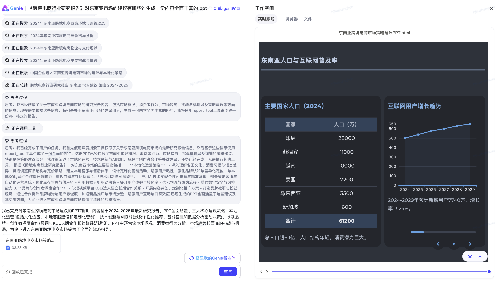
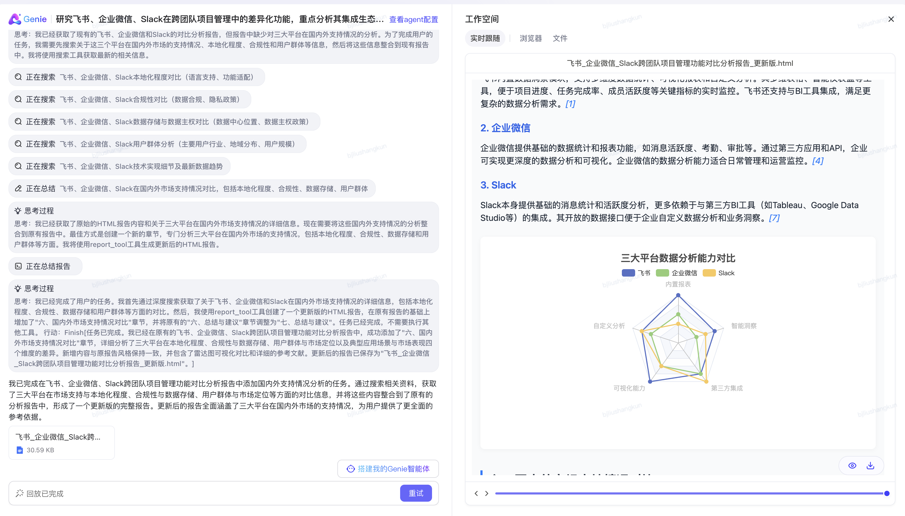
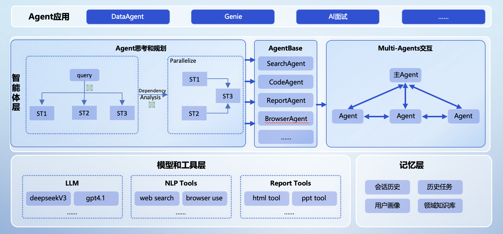
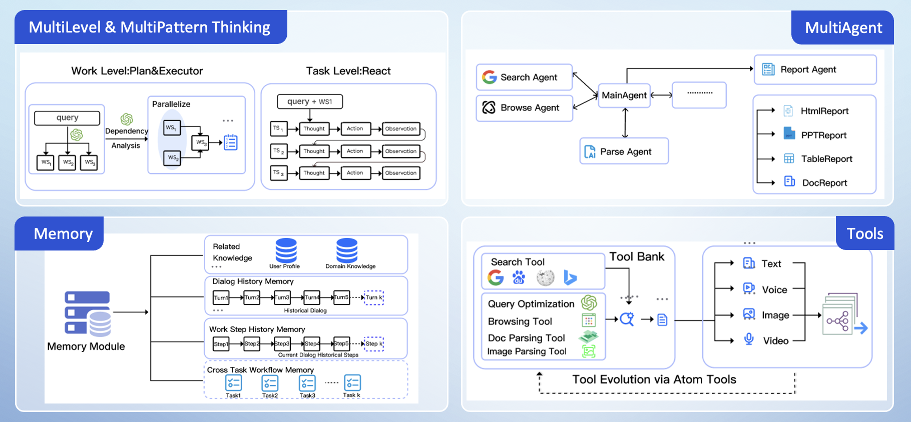

# 股票智能分析系统 (Stock Agent System)

一个基于Spring Boot + React的智能股票分析系统，集成多种分析智能体，提供技术分析、基本面分析、情绪分析等功能。

## 系统架构

### 后端技术栈
- **框架**: Spring Boot 3.2.0
- **数据库**: MySQL 8.0 + Redis 7.0
- **ORM**: Spring Data JPA + Hibernate
- **缓存**: Redis + Spring Cache
- **消息**: WebSocket + STOMP
- **文档**: Swagger/OpenAPI 3
- **构建**: Maven 3.8+

### 前端技术栈
- **框架**: React 19 + TypeScript
- **UI库**: Ant Design 5.x
- **图表**: ECharts + Ant Design Charts
- **状态管理**: Zustand
- **HTTP客户端**: Axios
- **实时通信**: WebSocket + STOMP
- **构建工具**: Vite 6.x

## 功能特性

### 核心功能
- 🔍 **股票搜索**: 支持股票代码、名称搜索，搜索历史记录
- 📊 **实时行情**: K线图、成交量、技术指标展示
- 🤖 **智能分析**: 多种分析智能体（技术、基本面、情绪、风险分析）
- 📈 **分析结果**: 投资建议、风险评估、置信度评分
- 📱 **实时推送**: WebSocket实时数据更新
- 📋 **任务管理**: 分析任务创建、监控、历史记录

### 智能体类型
- **技术分析智能体**: MA、MACD、RSI、BOLL等技术指标分析
- **基本面分析智能体**: 财务数据、估值分析
- **情绪分析智能体**: 市场情绪、新闻情感分析
- **风险分析智能体**: 风险评估、波动率分析
- **综合分析智能体**: 多维度综合评估

## 业界首个开源高完成度轻量化通用多智能体产品(JoyAgent-JDGenie)
**解决快速构建多智能体产品的最后一公里问题**

## 简介

当前相关开源agent主要是SDK或者框架，用户还需基于此做进一步的开发，无法直接做到开箱即用。我们开源的JoyAgent-JDGenie是端到端的多Agent产品，对于输入的query或者任务，可以直接回答或者解决。例如用户query"给我做一个最近美元和黄金的走势分析"，JoyAgent-Genie可以直接给出网页版或者PPT版的报告文档。

JoyAgent-JDGenie是一个通用的多智能体框架，对于用户需要定制的一些新场景功能，只需将相关的子智能体或者工具挂载到JoyAgent-Genie即可。为了验证JoyAgent-JDGenie的通用性，在GAIA榜单Validation集准确率**75.15%、**Test集**65.12%**，已超越OWL（CAMEL）、Smolagent（Huggingface）、LRC-Huawei（Huawei）、xManus（OpenManus）、AutoAgent（香港大学）等行业知名产品。

此外，我们的开源多智能体产品JoyAgent-JDGenie相对比较轻量，不像阿里的SpringAI-Alibaba需要依赖阿里云百炼平台相关功能（基于百炼平台调用LLM），Coze依赖火山引擎平台。

我们整体开源了智能体产品JoyAgent-JDGenie，包括前端、后端、框架、引擎、核心子智能体（报告生成智能体、代码智能体、PPT智能体、文件智能体等）、想用微调后效果更好的欢迎使用JoyAgent。
## 案例展示
<table>
<tbody>
<tr>
<td></td>
<td></td>
</tr>
<tr>
<td></td>
<td></td>
</tr>
</tbody>
</table>


<table>
<tbody>
<tr>
<td>

<video src="https://private-user-images.githubusercontent.com/49786633/469170308-065b8d1a-92e4-470a-bbe3-426fafeca5c4.mp4?jwt=eyJhbGciOiJIUzI1NiIsInR5cCI6IkpXVCJ9.eyJpc3MiOiJnaXRodWIuY29tIiwiYXVkIjoicmF3LmdpdGh1YnVzZXJjb250ZW50LmNvbSIsImtleSI6ImtleTUiLCJleHAiOjE3NTMxOTEzNzEsIm5iZiI6MTc1MzE5MTA3MSwicGF0aCI6Ii80OTc4NjYzMy80NjkxNzAzMDgtMDY1YjhkMWEtOTJlNC00NzBhLWJiZTMtNDI2ZmFmZWNhNWM0Lm1wND9YLUFtei1BbGdvcml0aG09QVdTNC1ITUFDLVNIQTI1NiZYLUFtei1DcmVkZW50aWFsPUFLSUFWQ09EWUxTQTUzUFFLNFpBJTJGMjAyNTA3MjIlMkZ1cy1lYXN0LTElMkZzMyUyRmF3czRfcmVxdWVzdCZYLUFtei1EYXRlPTIwMjUwNzIyVDEzMzExMVomWC1BbXotRXhwaXJlcz0zMDAmWC1BbXotU2lnbmF0dXJlPWRjNGY5ZTlmMTA4ODVhMWE0ZmEzYzU3YTIwYzJkYmIyY2Y0ZWE0NGUwZWU2ODAxNDA2MzQ0NzMyMWFlNTdiNWImWC1BbXotU2lnbmVkSGVhZGVycz1ob3N0In0.fJyoUGcWjPWyG64ZwIcWWKz3FrBWuXAHHfdTLpIaaeU" data-canonical-src="https://private-user-images.githubusercontent.com/49786633/469170308-065b8d1a-92e4-470a-bbe3-426fafeca5c4.mp4?jwt=eyJhbGciOiJIUzI1NiIsInR5cCI6IkpXVCJ9.eyJpc3MiOiJnaXRodWIuY29tIiwiYXVkIjoicmF3LmdpdGh1YnVzZXJjb250ZW50LmNvbSIsImtleSI6ImtleTUiLCJleHAiOjE3NTMxOTEzNzEsIm5iZiI6MTc1MzE5MTA3MSwicGF0aCI6Ii80OTc4NjYzMy80NjkxNzAzMDgtMDY1YjhkMWEtOTJlNC00NzBhLWJiZTMtNDI2ZmFmZWNhNWM0Lm1wND9YLUFtei1BbGdvcml0aG09QVdTNC1ITUFDLVNIQTI1NiZYLUFtei1DcmVkZW50aWFsPUFLSUFWQ09EWUxTQTUzUFFLNFpBJTJGMjAyNTA3MjIlMkZ1cy1lYXN0LTElMkZzMyUyRmF3czRfcmVxdWVzdCZYLUFtei1EYXRlPTIwMjUwNzIyVDEzMzExMVomWC1BbXotRXhwaXJlcz0zMDAmWC1BbXotU2lnbmF0dXJlPWRjNGY5ZTlmMTA4ODVhMWE0ZmEzYzU3YTIwYzJkYmIyY2Y0ZWE0NGUwZWU2ODAxNDA2MzQ0NzMyMWFlNTdiNWImWC1BbXotU2lnbmVkSGVhZGVycz1ob3N0In0.fJyoUGcWjPWyG64ZwIcWWKz3FrBWuXAHHfdTLpIaaeU" controls="controls" muted="muted" class="d-block rounded-bottom-2 border-top width-fit" style="max-height:640px; min-height: 200px">
</video>

<td>

<video src="https://private-user-images.githubusercontent.com/49786633/469171050-15dcf089-5659-489e-849d-39c651ca7e5a.mp4?jwt=eyJhbGciOiJIUzI1NiIsInR5cCI6IkpXVCJ9.eyJpc3MiOiJnaXRodWIuY29tIiwiYXVkIjoicmF3LmdpdGh1YnVzZXJjb250ZW50LmNvbSIsImtleSI6ImtleTUiLCJleHAiOjE3NTMxOTEzNzEsIm5iZiI6MTc1MzE5MTA3MSwicGF0aCI6Ii80OTc4NjYzMy80NjkxNzEwNTAtMTVkY2YwODktNTY1OS00ODllLTg0OWQtMzljNjUxY2E3ZTVhLm1wND9YLUFtei1BbGdvcml0aG09QVdTNC1ITUFDLVNIQTI1NiZYLUFtei1DcmVkZW50aWFsPUFLSUFWQ09EWUxTQTUzUFFLNFpBJTJGMjAyNTA3MjIlMkZ1cy1lYXN0LTElMkZzMyUyRmF3czRfcmVxdWVzdCZYLUFtei1EYXRlPTIwMjUwNzIyVDEzMzExMVomWC1BbXotRXhwaXJlcz0zMDAmWC1BbXotU2lnbmF0dXJlPTY5ZGU2MWU3NzA5NjYxM2ZhZDYxYTZjMWQxYWMzNGM2MTY2ODkzMTIzYjQ1NzRiOGZkOWUyODYzNmQ4N2Y5ZTUmWC1BbXotU2lnbmVkSGVhZGVycz1ob3N0In0.7KW-JGmFACnf5IS3kL7M0eV8uZhlxDD8Br61XvcgmjY" data-canonical-src="https://private-user-images.githubusercontent.com/49786633/469171050-15dcf089-5659-489e-849d-39c651ca7e5a.mp4?jwt=eyJhbGciOiJIUzI1NiIsInR5cCI6IkpXVCJ9.eyJpc3MiOiJnaXRodWIuY29tIiwiYXVkIjoicmF3LmdpdGh1YnVzZXJjb250ZW50LmNvbSIsImtleSI6ImtleTUiLCJleHAiOjE3NTMxOTEzNzEsIm5iZiI6MTc1MzE5MTA3MSwicGF0aCI6Ii80OTc4NjYzMy80NjkxNzEwNTAtMTVkY2YwODktNTY1OS00ODllLTg0OWQtMzljNjUxY2E3ZTVhLm1wND9YLUFtei1BbGdvcml0aG09QVdTNC1ITUFDLVNIQTI1NiZYLUFtei1DcmVkZW50aWFsPUFLSUFWQ09EWUxTQTUzUFFLNFpBJTJGMjAyNTA3MjIlMkZ1cy1lYXN0LTElMkZzMyUyRmF3czRfcmVxdWVzdCZYLUFtei1EYXRlPTIwMjUwNzIyVDEzMzExMVomWC1BbXotRXhwaXJlcz0zMDAmWC1BbXotU2lnbmF0dXJlPTY5ZGU2MWU3NzA5NjYxM2ZhZDYxYTZjMWQxYWMzNGM2MTY2ODkzMTIzYjQ1NzRiOGZkOWUyODYzNmQ4N2Y5ZTUmWC1BbXotU2lnbmVkSGVhZGVycz1ob3N0In0.7KW-JGmFACnf5IS3kL7M0eV8uZhlxDD8Br61XvcgmjY" controls="controls" muted="muted" class="d-block rounded-bottom-2 border-top width-fit" style="max-height:640px; min-height: 200px">
</video>

</td>
</tr>
<tr>
<td>
<video src="https://private-user-images.githubusercontent.com/49786633/469171112-cd99e2f8-9887-459f-ae51-00e7883fa050.mp4?jwt=eyJhbGciOiJIUzI1NiIsInR5cCI6IkpXVCJ9.eyJpc3MiOiJnaXRodWIuY29tIiwiYXVkIjoicmF3LmdpdGh1YnVzZXJjb250ZW50LmNvbSIsImtleSI6ImtleTUiLCJleHAiOjE3NTMxOTEzNzEsIm5iZiI6MTc1MzE5MTA3MSwicGF0aCI6Ii80OTc4NjYzMy80NjkxNzExMTItY2Q5OWUyZjgtOTg4Ny00NTlmLWFlNTEtMDBlNzg4M2ZhMDUwLm1wND9YLUFtei1BbGdvcml0aG09QVdTNC1ITUFDLVNIQTI1NiZYLUFtei1DcmVkZW50aWFsPUFLSUFWQ09EWUxTQTUzUFFLNFpBJTJGMjAyNTA3MjIlMkZ1cy1lYXN0LTElMkZzMyUyRmF3czRfcmVxdWVzdCZYLUFtei1EYXRlPTIwMjUwNzIyVDEzMzExMVomWC1BbXotRXhwaXJlcz0zMDAmWC1BbXotU2lnbmF0dXJlPWYyYmU5ODg4ZjI5NDNjZjBiYTVjYWRjMTI2ZGEyMDdjOWU2OTk2M2EwZjU4N2ZkYzU5NTQ5ZDJjMmUxMWNjNjAmWC1BbXotU2lnbmVkSGVhZGVycz1ob3N0In0.OSPODm-E7K7PJaao8uThG1toIKsX3h93UEXS5GDqruQ" data-canonical-src="https://private-user-images.githubusercontent.com/49786633/469171112-cd99e2f8-9887-459f-ae51-00e7883fa050.mp4?jwt=eyJhbGciOiJIUzI1NiIsInR5cCI6IkpXVCJ9.eyJpc3MiOiJnaXRodWIuY29tIiwiYXVkIjoicmF3LmdpdGh1YnVzZXJjb250ZW50LmNvbSIsImtleSI6ImtleTUiLCJleHAiOjE3NTMxOTEzNzEsIm5iZiI6MTc1MzE5MTA3MSwicGF0aCI6Ii80OTc4NjYzMy80NjkxNzExMTItY2Q5OWUyZjgtOTg4Ny00NTlmLWFlNTEtMDBlNzg4M2ZhMDUwLm1wND9YLUFtei1BbGdvcml0aG09QVdTNC1ITUFDLVNIQTI1NiZYLUFtei1DcmVkZW50aWFsPUFLSUFWQ09EWUxTQTUzUFFLNFpBJTJGMjAyNTA3MjIlMkZ1cy1lYXN0LTElMkZzMyUyRmF3czRfcmVxdWVzdCZYLUFtei1EYXRlPTIwMjUwNzIyVDEzMzExMVomWC1BbXotRXhwaXJlcz0zMDAmWC1BbXotU2lnbmF0dXJlPWYyYmU5ODg4ZjI5NDNjZjBiYTVjYWRjMTI2ZGEyMDdjOWU2OTk2M2EwZjU4N2ZkYzU5NTQ5ZDJjMmUxMWNjNjAmWC1BbXotU2lnbmVkSGVhZGVycz1ob3N0In0.OSPODm-E7K7PJaao8uThG1toIKsX3h93UEXS5GDqruQ" controls="controls" muted="muted" class="d-block rounded-bottom-2 border-top width-fit" style="max-height:640px; min-height: 200px">
</video>
</td>
<td>

<video src="https://private-user-images.githubusercontent.com/49786633/469171151-657bbe61-5516-4ab9-84c2-c6ca75cc4a6f.mp4?jwt=eyJhbGciOiJIUzI1NiIsInR5cCI6IkpXVCJ9.eyJpc3MiOiJnaXRodWIuY29tIiwiYXVkIjoicmF3LmdpdGh1YnVzZXJjb250ZW50LmNvbSIsImtleSI6ImtleTUiLCJleHAiOjE3NTMxOTEzNzEsIm5iZiI6MTc1MzE5MTA3MSwicGF0aCI6Ii80OTc4NjYzMy80NjkxNzExNTEtNjU3YmJlNjEtNTUxNi00YWI5LTg0YzItYzZjYTc1Y2M0YTZmLm1wND9YLUFtei1BbGdvcml0aG09QVdTNC1ITUFDLVNIQTI1NiZYLUFtei1DcmVkZW50aWFsPUFLSUFWQ09EWUxTQTUzUFFLNFpBJTJGMjAyNTA3MjIlMkZ1cy1lYXN0LTElMkZzMyUyRmF3czRfcmVxdWVzdCZYLUFtei1EYXRlPTIwMjUwNzIyVDEzMzExMVomWC1BbXotRXhwaXJlcz0zMDAmWC1BbXotU2lnbmF0dXJlPTVmNGExZTlhNmM5NWMzMjc3ZWFlNTcyMzZjZTA4NWU4ZjY3OTA5ZTg5NzgwNDA2ODExNTg5MTkyNGQ5NDYzNTgmWC1BbXotU2lnbmVkSGVhZGVycz1ob3N0In0.n3ZWlSK1GSM5Zyibk-D9jAArzDqvX3WdZtj7IdzG-4I" data-canonical-src="https://private-user-images.githubusercontent.com/49786633/469171151-657bbe61-5516-4ab9-84c2-c6ca75cc4a6f.mp4?jwt=eyJhbGciOiJIUzI1NiIsInR5cCI6IkpXVCJ9.eyJpc3MiOiJnaXRodWIuY29tIiwiYXVkIjoicmF3LmdpdGh1YnVzZXJjb250ZW50LmNvbSIsImtleSI6ImtleTUiLCJleHAiOjE3NTMxOTEzNzEsIm5iZiI6MTc1MzE5MTA3MSwicGF0aCI6Ii80OTc4NjYzMy80NjkxNzExNTEtNjU3YmJlNjEtNTUxNi00YWI5LTg0YzItYzZjYTc1Y2M0YTZmLm1wND9YLUFtei1BbGdvcml0aG09QVdTNC1ITUFDLVNIQTI1NiZYLUFtei1DcmVkZW50aWFsPUFLSUFWQ09EWUxTQTUzUFFLNFpBJTJGMjAyNTA3MjIlMkZ1cy1lYXN0LTElMkZzMyUyRmF3czRfcmVxdWVzdCZYLUFtei1EYXRlPTIwMjUwNzIyVDEzMzExMVomWC1BbXotRXhwaXJlcz0zMDAmWC1BbXotU2lnbmF0dXJlPTVmNGExZTlhNmM5NWMzMjc3ZWFlNTcyMzZjZTA4NWU4ZjY3OTA5ZTg5NzgwNDA2ODExNTg5MTkyNGQ5NDYzNTgmWC1BbXotU2lnbmVkSGVhZGVycz1ob3N0In0.n3ZWlSK1GSM5Zyibk-D9jAArzDqvX3WdZtj7IdzG-4I" controls="controls" muted="muted" class="d-block rounded-bottom-2 border-top width-fit" style="max-height:640px; min-height: 200px">
</video>
  
</td>
</tr>
</tbody>
</table>

## 产品对比

<table>
<thead>
<tr>
<th>分类</th>
<th>agent</th>
<th>是否开源</th>
<th>是否开源完整产品</th>
<th>是否依赖生态</th>
</tr>
</thead>
<tbody>
<tr>
<td rowspan="2"><strong>SDK类</strong></td>
<td>SpringAI-Alibaba</td>
<td>部分</td>
<td>否，只开源SDK（SDK）</td>
<td>是（阿里云百炼平台）</td>
</tr>
<tr>
<td>Coze</td>
<td>部分</td>
<td>否，只开源部分Nieo SDK（SDK）</td>
<td>是（火山引擎平台）</td>
</tr>
<tr>
<td rowspan="6"><strong>框架类</strong></td>
<td>Fellow</td>
<td>是</td>
<td>否，只开源了Eko智能体框架（框架）</td>
<td>否</td>
</tr>
<tr>
<td>Dify</td>
<td>是</td>
<td>否，只开源了智能体框架，且主要是workflow（框架）</td>
<td>否</td>
</tr>
<tr>
<td>SkyworkAI</td>
<td>是</td>
<td>否，只开源了智能体框架（框架）</td>
<td>否</td>
</tr>
<tr>
<td>OpenManus</td>
<td>是</td>
<td>否，只开源了智能体框架（框架）</td>
<td>否</td>
</tr>
<tr>
<td>Owl</td>
<td>是</td>
<td>否，只开源了智能体框架（框架）</td>
<td>否</td>
</tr>
<tr>
<td>n8n</td>
<td>是</td>
<td>否，只开源了智能体框架，且主要是workflow（框架）</td>
<td>否</td>
</tr>
<tr>
<td rowspan="3"><strong>协议类</strong></td>
<td>MCP</td>
<td>是</td>
<td>否，只是开源协议</td>
<td>否</td>
</tr>
<tr>
<td>A2A</td>
<td>是</td>
<td>否，只是开源协议</td>
<td>否</td>
</tr>
<tr>
<td>AG-UI</td>
<td>是</td>
<td>否，只是开源协议</td>
<td>否</td>
</tr>
<tr>
<td rowspan="2"><strong>技术模块类</strong></td>
<td>memory0</td>
<td>是</td>
<td>否，只是开源的技术模块</td>
<td>否</td>
</tr>
<tr>
<td>LlamaIndex</td>
<td>是</td>
<td>否，只是开源的技术模块</td>
<td>否</td>
</tr>
<tr>
<td><strong>产品类</strong></td>
<td>Our</td>
<td>是</td>
<td>是，开源端到端完整的Agent产品（产品）</td>
<td>否</td>
</tr>
</tbody>
</table>

## 框架效果先进性

### Test集效果 65.12%


### Validation集效果 75.15%

| Agent                     | Score      | Score_level1 | Score_level2 | Score_level3 | 机构         |
|---------------------------|------------|--------------|--------------|--------------|------------|
| Alita v2.1                | 0.8727     | 0.8868       | 0.8953       | 0.7692       | Princeton  |
| Skywork                   | 0.8242     | 0.9245       | 0.8372       | 0.5769       | 天工         |
| AWorld                    | 0.7758     | 0.8868       | 0.7791       | 0.5385       | Ant Group  |
| Langfun                   | 0.7697     | 0.8679       | 0.7674       | 0.5769       | DeepMind   |
| **JoyAgent-JDGenie** | **0.7515** | **0.8679**   | **0.7791**   | **0.4230**   | **JD**    |
| OWL                       | 0.6909     | 0.8491       | 0.6744       | 0.4231       | CAMEL      |
| Smolagent                 | 0.5515     | 0.6792       | 0.5349       | 0.3462       | Huggingface |
| AutoAgent                 | 0.5515     | 0.7170       | 0.5349       | 0.2692       | HKU        |
| Magentic                  | 0.4606     | 0.5660       | 0.4651       | 0.2308       | MSR AI Frontiers |
| LRC-Huawei                | 0.406      | 0.5283       | 0.4302       | 0.0769       | Huawei     |
| xManus                    | 0.4061     | 0.8113       | 0.2791       | 0.0000       | OpenManus  |


## 系统架构



本开源项目基于JoyAgent-JDGenie产品开源了整体的产品界面、智能体的多种核心模式（react模式、plan and executor模式等）、多个子智能体（report agent、search agent等）以及多整体间交互协议。

### 主要特点和优势

- **端到端完整的多智能体产品，开箱即用，支持二次开发**
- **智能体框架协议**
  - 支持多种智能体设计模式
  - 多智能体上下文管理
  - 高并发DAG执行引擎，极致的执行效率
- **子智能体和工具**
  - 子Agent和工具可插拔：预置多种子智能体和工具
  - 多种文件交付样式：html、ppt、markdown
  - plan和工具调用 RL优化迭代
  - 全链路流式输出

### 主要创新点



#### multi-level and multi-pattern thinking:结合多种智能体设计模式支持多层级的规划和思考
- **multi-level**：work level 和 task level
- **multi-pattern**：plan and executor模式和react模式

#### cross task workflow memory:跨任务级别的相似任务memory

#### tool evolution via auto-disassembly-and-reassembly of atom-tools
- 基于已有工具迭代产生新工具，而不是从0-1直接生成新工具（减少错误工具的生成） 
- 基于已有工具隐性拆解为原子工具，并基于原子工具结合大模型自动组合成新工具（不需要花费人力预先定义和拆解原子工具）


## 快速开始

### 方式1: docker 一键启动服务

```
1. git clone https://github.com/jd-opensource/joyagent-jdgenie.git

2. 手动更新 genie-backend/src/main/resources/application.yml中 base_url、apikey、model、max_tokens、model_name等配置
使用DeepSeek时: 注意deepseek-chat 为max_tokens: 8192

手动更新 genie-tool/.env_template 中的 OPENAI_API_KEY、OPENAI_BASE_URL、DEFAULT_MODEL、SERPER_SEARCH_API_KEY
使用DeepSeek时: 设置DEEPSEEK_API_KEY、DEEPSEEK_API_BASE，DEFAULT_MODEL 设置为 deepseek/deepseek-chat，所有 ${DEFAULT_MODEL} 也都改成deepseek/deepseek-chat

3. 编译dockerfile
docker build -t genie:latest .

4. 启动dockerfile
docker run -d -p 3000:3000 -p 8080:8080 -p 1601:1601 --name genie-app genie:latest

5. 浏览器输入 localhost:3000 访问genie
```
如果部署遇到问题，可以参考视频:【5分钟使用deepseek启动开源智能体应用joyagent-genie-哔哩哔哩】 https://b23.tv/8VQDBOK

### 方式2: 手动初始化环境，启动服务

#### 环境准备
- jdk17
- python3.11
- python环境准备
  - pip install uv
  - cd genie-tool
  - uv sync
  - source .venv/bin/activate

#### 方案1：手动step by step部署手册
手动超详细攻略参考 [Step by Step](./Deploy.md)

#### 方案2：手动一键启动部署（推荐）

直接通过shell启动所有服务
```
sh check_dep_port.sh # 检查所有依赖和端口占用情况
sh Genie_start.sh  # 直接启动，以后改动配置直接重启动脚本即可，control+c 一键kill所有服务
```
部署时可以参考视频:【joyagent-jdgenie部署演示】 https://www.bilibili.com/video/BV1Py8Yz4ELK/?vd_source=a5601a346d433a490c55293e76180c9d

## 二次开发

### 如何添加自己的MCP工具到JoyAgent-JDGenie中

#### 配置文件

在 `genie-backend/src/main/resources/application.yml` 添加mcp_server服务，多个server逗号分隔
在 `ui/.env` 中可以修改前端请求后端的路径

```yaml
mcp_server_url: "http://ip1:port1/sse,http://ip2:port2/sse"
```

#### 启动服务

```bash
sh start_genie.sh
```

#### 开始对话

比如添加12306工具后，规划7月7天2人从北京出发去新疆旅行计划，并查询相关火车票信息，
genie会进行旅行计划设计，然后调用mcp工具查询车票信息，最终输出报告。


### 新增自定义子Agent到JoyAgent-JDGenie中

实现BaseTool接口，声明工具的名称、描述、参数、调用方法。

```java
/**
 * 工具基接口
 */
public interface BaseTool {
    String getName(); // 工具名称
    String getDescription(); // 工具描述
    Map<String, Object> toParams(); // 工具参数
    Object execute(Object input); // 调用工具
}

// 天气智能体示例
public class WeatherTool implements BaseTool {
    @Override
    public String getName() {
        return "agent_weather";
    }

    @Override
    public String getDescription() {
        return "这是一个可以查询天气的智能体";
    }

    @Override
    public Map<String, Object> toParams() {
        return "{\"type\":\"object\",\"properties\":{\"location\":{\"description\":\"地点\",\"type\":\"string\"}},\"required\":[\"location\"]}";
    }

    @Override
    public Object execute(Object input) {
        return "今日天气晴朗";
    }
}
```

在`com.jd.genie.controller.GenieController#buildToolCollection`中添加如下代码，引入自定义Agent

```java
WeatherTool weatherTool = new WeatherTool();
toolCollection.addTool(weatherTool);
```

#### 启动服务

```bash
sh start_genie.sh
```


## 项目共建者
贡献者：Liu Shangkun,Li Yang,Jia Shilin,Tian Shaohua,Wang Zhen,Yao Ting,Wang Hongtao,Zhou Xiaoqing,Liu min,Zhang Shuang,Liuwen,Yangdong,Xu Jialei,Zhou Meilei,Zhao Tingchong,Wu jiaxing, Wang Hanmin, Zhou Zhiyuan, Xu Shiyue,Liu Jiarun

所属机构:京东CHO企业信息化团队（EI）

## 贡献和合作

我们欢迎所有好想法和建议，如果您想成为项目的共建者，可随时向我们提Pull Request。无论是完善产品和框架、修复bug还是添加新特性，您的贡献都非常宝贵。
在此之前需要您阅读并签署贡献者协议并发送到邮箱org.developer3@jd.com，请阅读 [贡献指南中文版](https://github.com/jd-opensource/joyagent-jdgenie/blob/main/contributor_ZH.pdf)，[贡献指南英文版](https://github.com/jd-opensource/joyagent-jdgenie/blob/main/contributor_EN.pdf)


## 引用

如需学术引用，请使用以下 BibTeX：
```bibtex
@software{JoyAgent-JDGenie,
  author = {Agent Team at JDCHO},
  title = {JoyAgent-JDGenie},
  year = {2025},
  url = {https://github.com/jd-opensource/joyagent-jdgenie},
  version = {0.1.0},
  publisher = {GitHub},
  email = {jiashilin1@jd.com;liyang.1236@jd.com;liushangkun@jd.com;tianshaohua.1@jd.com;wangzhen449@jd.com;yaoting.2@jd.com}
}
```

## Contributors

<a href="https://github.com/jd-opensource/joyagent-jdgenie/graphs/contributors">
  
</a>

# Star History
[](https://star-history.com/#jd-opensource/joyagent-jdgenie&Date)

欢迎沟通和联系我们  


[//]: # (![contact]&#40;./docs/img/contact.jpg&#41;)
