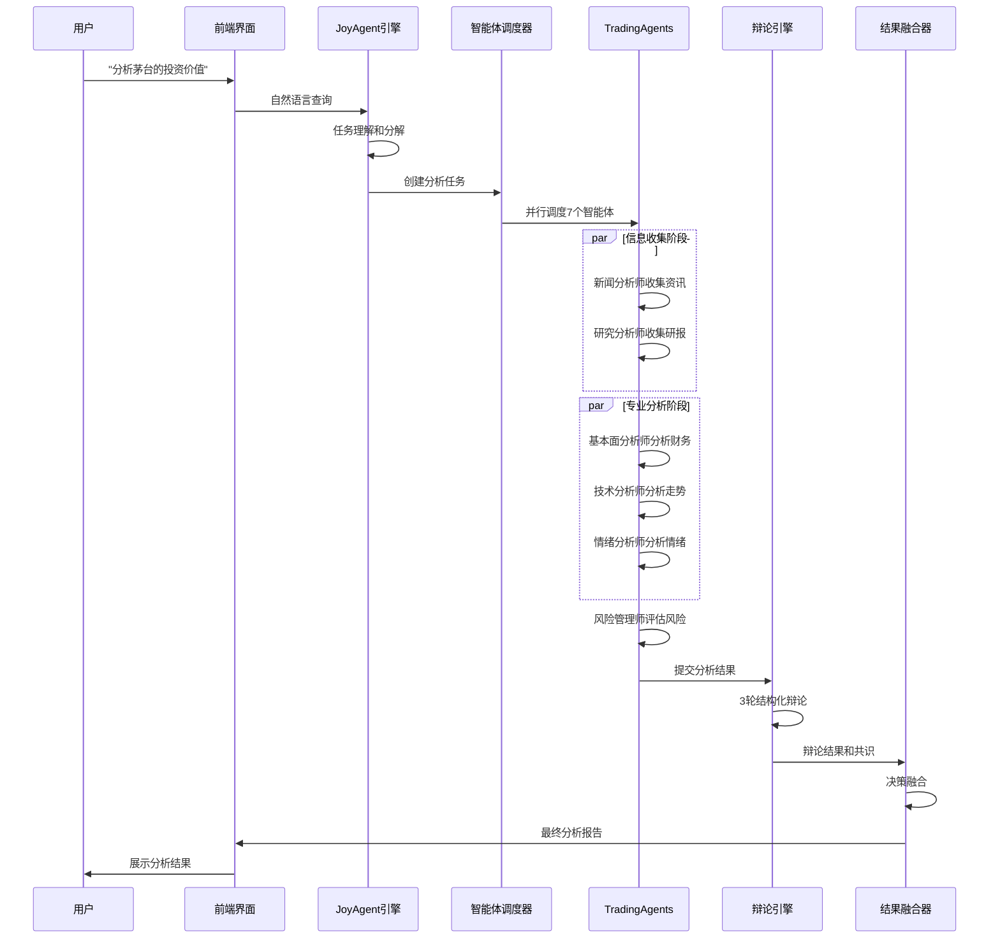

# TradingAgents + JoyAgent-JDGenie 融合架构设计

> 基于TradingAgents协作模型和JoyAgent-JDGenie通用多智能体框架的深度融合架构

## 1. 架构设计理念

### 1.1 融合目标
- **TradingAgents专业性**: 利用7个专业金融分析师的结构化辩论机制
- **JoyAgent-JDGenie通用性**: 借鉴端到端多智能体产品的工程化经验
- **Go-Stock数据能力**: 继承丰富的多源金融数据获取能力
- **用户自定义扩展**: 支持Coze风格的工作流自定义和MCP工具集成

### 1.2 核心创新点
1. **分层协作架构**: JoyAgent-JDGenie引擎 + TradingAgents专业层
2. **结构化金融辩论**: 基于学术研究的多轮辩论和共识构建
3. **端到端智能分析**: 从自然语言查询到专业分析报告的完整链路
4. **开放生态集成**: MCP工具生态 + 用户自定义智能体

## 2. 分层架构设计

### 2.1 用户交互层 (React + JoyAgent-JDGenie UI)

```typescript
// 智能分析工作台组件架构
interface AnalysisWorkbench {
  // 查询输入组件
  queryInput: {
    naturalLanguageInput: string;  // "分析一下茅台的投资价值"
    stockSelector: string[];        // 股票选择器
    analysisScope: AnalysisScope;   // 分析范围配置
  };
  
  // 协作可视化组件
  collaborationVisualization: {
    agentStatus: AgentStatusPanel;     // 智能体状态面板
    debateProcess: DebateVisualization; // 辩论过程可视化
    consensusBuilding: ConsensusChart;  // 共识构建图表
  };
  
  // 结果展示组件
  resultDisplay: {
    executiveSummary: ExecutiveSummary; // 执行摘要
    detailedAnalysis: DetailedReport;   // 详细分析报告
    riskAssessment: RiskMatrix;         // 风险评估矩阵
    investmentAdvice: InvestmentAdvice; // 投资建议
  };
  
  // 工作流设计器
  workflowDesigner: {
    nodeLibrary: CustomNodeLibrary;     // 自定义节点库
    flowCanvas: WorkflowCanvas;         // 工作流画布
    templateMarket: TemplateMarketplace; // 模板市场
  };
}
```

### 2.2 JoyAgent-JDGenie核心引擎层

```java
// 任务理解模块
@Component
public class TaskUnderstandingModule {
    
    public AnalysisTask parseNaturalLanguageQuery(String query) {
        // 1. 意图识别
        Intent intent = intentRecognizer.recognize(query);
        
        // 2. 实体提取
        List<Entity> entities = entityExtractor.extract(query);
        
        // 3. 任务分解
        return AnalysisTask.builder()
            .intent(intent)
            .targetStocks(extractStocks(entities))
            .analysisType(extractAnalysisType(intent))
            .timeHorizon(extractTimeHorizon(entities))
            .riskTolerance(extractRiskTolerance(entities))
            .build();
    }
}

// 智能体调度器
@Component
public class AgentScheduler {
    
    public CompletableFuture<AnalysisResult> scheduleAnalysis(AnalysisTask task) {
        // 1. 确定参与的智能体
        List<FinancialAgent> participants = selectParticipants(task);
        
        // 2. 构建执行DAG
        AnalysisDAG dag = buildAnalysisDAG(participants, task);
        
        // 3. 并发执行
        return executeDAG(dag);
    }
    
    private AnalysisDAG buildAnalysisDAG(List<FinancialAgent> agents, AnalysisTask task) {
        return AnalysisDAG.builder()
            // 阶段1: 信息收集（并行）
            .addParallelStage("information_gathering", 
                Arrays.asList("news_analyst", "research_analyst"))
            // 阶段2: 专业分析（并行）
            .addParallelStage("professional_analysis", 
                Arrays.asList("fundamental_analyst", "technical_analyst", "sentiment_analyst"))
            // 阶段3: 风险评估（串行）
            .addSequentialStage("risk_assessment", 
                Arrays.asList("risk_manager"))
            // 阶段4: 结构化辩论（协作）
            .addCollaborativeStage("structured_debate", 
                Arrays.asList("all_analysts"))
            // 阶段5: 决策融合（串行）
            .addSequentialStage("decision_fusion", 
                Arrays.asList("trader"))
            .build();
    }
}

// 协作编排引擎
@Component
public class CollaborationOrchestrator {
    
    public DebateResult conductStructuredDebate(List<AnalysisResult> analyses) {
        // 1. 观点分类
        Map<Sentiment, List<AnalysisResult>> sentimentGroups = 
            analyses.stream().collect(Collectors.groupingBy(AnalysisResult::getSentiment));
        
        // 2. 多轮辩论
        List<DebateRound> rounds = new ArrayList<>();
        for (int round = 1; round <= 3; round++) {
            DebateRound debateRound = conductDebateRound(sentimentGroups, round);
            rounds.add(debateRound);
            
            // 基于辩论结果更新置信度
            updateConfidenceBasedOnDebate(analyses, debateRound);
        }
        
        // 3. 构建共识
        Consensus consensus = buildConsensus(rounds, analyses);
        
        return DebateResult.builder()
            .rounds(rounds)
            .consensus(consensus)
            .finalDistribution(calculateFinalDistribution(analyses))
            .build();
    }
}
```

### 2.3 TradingAgents协作层

```java
// 基础金融智能体抽象类
public abstract class AbstractFinancialAgent {
    
    protected LLMService llmService;
    protected DataService dataService;
    protected String agentRole;
    protected String systemPrompt;
    
    public abstract AnalysisResult analyze(AnalysisContext context);
    
    // 智能体间通信接口
    public void receiveMessage(AgentMessage message) {
        // 处理来自其他智能体的消息
    }
    
    public AgentMessage sendMessage(String targetAgent, Object content) {
        // 向其他智能体发送消息
        return AgentMessage.builder()
            .from(this.agentRole)
            .to(targetAgent)
            .content(content)
            .timestamp(Instant.now())
            .build();
    }
}

// 基本面分析师实现
@Component
public class FundamentalAnalyst extends AbstractFinancialAgent {
    
    @Override
    public AnalysisResult analyze(AnalysisContext context) {
        String stockCode = context.getStockCode();
        
        // 1. 获取财务数据
        FinancialData financialData = dataService.getFinancialData(stockCode);
        
        // 2. 计算关键指标
        FinancialRatios ratios = calculateFinancialRatios(financialData);
        
        // 3. 行业对比
        IndustryComparison comparison = compareWithIndustry(stockCode, ratios);
        
        // 4. 估值分析
        ValuationResult valuation = performValuation(financialData, ratios);
        
        // 5. LLM分析
        String prompt = buildAnalysisPrompt(financialData, ratios, comparison, valuation);
        String llmResponse = llmService.chat(prompt);
        
        return AnalysisResult.builder()
            .agentType("FUNDAMENTAL_ANALYST")
            .sentiment(extractSentiment(llmResponse))
            .confidence(extractConfidence(llmResponse))
            .reasoning(llmResponse)
            .data(Map.of(
                "ratios", ratios,
                "comparison", comparison,
                "valuation", valuation
            ))
            .build();
    }
}

// 结构化辩论引擎
@Component
public class StructuredDebateEngine {
    
    public DebateRound conductDebateRound(Map<Sentiment, List<AnalysisResult>> groups, int round) {
        DebateRound debateRound = new DebateRound(round);
        
        // 看多方论证
        if (groups.containsKey(Sentiment.BULLISH)) {
            String bullishArgument = generateCollectiveArgument(
                groups.get(Sentiment.BULLISH), 
                "请基于以下分析结果，构建看多论证，并反驳看空观点",
                round
            );
            debateRound.addArgument(Sentiment.BULLISH, bullishArgument);
        }
        
        // 看空方论证
        if (groups.containsKey(Sentiment.BEARISH)) {
            String bearishArgument = generateCollectiveArgument(
                groups.get(Sentiment.BEARISH),
                "请基于以下分析结果，构建看空论证，并反驳看多观点",
                round
            );
            debateRound.addArgument(Sentiment.BEARISH, bearishArgument);
        }
        
        // 中性方调解
        if (groups.containsKey(Sentiment.NEUTRAL)) {
            String neutralMediation = generateCollectiveArgument(
                groups.get(Sentiment.NEUTRAL),
                "请基于以下分析结果，提供中性观点，调解多空分歧",
                round
            );
            debateRound.addArgument(Sentiment.NEUTRAL, neutralMediation);
        }
        
        return debateRound;
    }
}
```

### 2.4 用户自定义扩展层

```java
// 自定义智能体接口
public interface CustomAgent {
    String getAgentId();
    String getAgentName();
    String getDescription();
    AnalysisResult execute(Map<String, Object> inputs);
    List<InputParameter> getInputParameters();
    List<OutputParameter> getOutputParameters();
}

// 自定义工作流节点
@Component
public class CustomWorkflowNode {
    
    private String nodeId;
    private String nodeType; // "agent", "data_source", "condition", "aggregator"
    private Map<String, Object> configuration;
    private List<String> inputConnections;
    private List<String> outputConnections;
    
    public NodeExecutionResult execute(WorkflowContext context) {
        switch (nodeType) {
            case "agent":
                return executeAgent(context);
            case "data_source":
                return executeDataSource(context);
            case "condition":
                return executeCondition(context);
            case "aggregator":
                return executeAggregator(context);
            default:
                throw new UnsupportedOperationException("Unknown node type: " + nodeType);
        }
    }
}

// MCP工具集成服务
@Service
public class MCPIntegrationService {
    
    public void registerMCPTool(MCPToolDefinition toolDef) {
        // 注册第三方MCP工具
        mcpRegistry.register(toolDef);
    }
    
    public Object invokeMCPTool(String toolId, Map<String, Object> parameters) {
        // 调用MCP工具
        MCPTool tool = mcpRegistry.getTool(toolId);
        return tool.invoke(parameters);
    }
    
    public List<MCPToolDefinition> getAvailableTools() {
        // 获取可用的MCP工具列表
        return mcpRegistry.getAllTools();
    }
}
```

## 3. 数据流设计

### 3.1 端到端分析流程



### 3.2 数据获取和处理流程

```java
// Go-Stock数据迁移适配器
@Component
public class GoStockDataAdapter {
    
    // 实时行情数据获取
    public StockRealTimeData getRealTimeData(String stockCode) {
        // 新浪财经API
        String sinaData = sinaFinanceClient.getRealTimeData(stockCode);
        
        // 腾讯财经API（备用）
        String tencentData = tencentFinanceClient.getRealTimeData(stockCode);
        
        // 数据融合和校验
        return dataFusionService.fuseRealTimeData(sinaData, tencentData);
    }
    
    // K线数据获取
    public List<KLineData> getKLineData(String stockCode, String period, int limit) {
        // 多源数据获取
        CompletableFuture<List<KLineData>> sinaFuture = 
            CompletableFuture.supplyAsync(() -> sinaFinanceClient.getKLineData(stockCode, period, limit));
        CompletableFuture<List<KLineData>> tencentFuture = 
            CompletableFuture.supplyAsync(() -> tencentFinanceClient.getKLineData(stockCode, period, limit));
        
        // 数据质量检查和融合
        return dataQualityService.validateAndFuse(
            sinaFuture.join(), 
            tencentFuture.join()
        );
    }
    
    // 财经新闻获取
    public List<NewsItem> getFinancialNews(String keyword, int limit) {
        // 财联社电报
        List<NewsItem> cailianNews = cailianpressClient.getNews(keyword, limit);
        
        // 其他新闻源
        List<NewsItem> otherNews = otherNewsClient.getNews(keyword, limit);
        
        // 新闻去重和排序
        return newsProcessingService.deduplicateAndSort(
            Stream.concat(cailianNews.stream(), otherNews.stream())
                .collect(Collectors.toList())
        );
    }
}
```

## 4. 核心算法设计

### 4.1 结构化辩论算法

```java
public class StructuredDebateAlgorithm {
    
    public Consensus buildConsensus(List<DebateRound> rounds, List<AnalysisResult> analyses) {
        // 1. 计算观点强度变化
        Map<Sentiment, Double> strengthEvolution = calculateStrengthEvolution(rounds);
        
        // 2. 识别关键争议点
        List<ContentiousIssue> issues = identifyContentiousIssues(rounds);
        
        // 3. 计算共识度
        double consensusLevel = calculateConsensusLevel(analyses, rounds);
        
        // 4. 生成最终观点
        FinalOpinion finalOpinion = generateFinalOpinion(analyses, rounds, consensusLevel);
        
        return Consensus.builder()
            .consensusLevel(consensusLevel)
            .finalOpinion(finalOpinion)
            .contentiousIssues(issues)
            .strengthEvolution(strengthEvolution)
            .build();
    }
    
    private double calculateConsensusLevel(List<AnalysisResult> analyses, List<DebateRound> rounds) {
        // 基于观点分布的方差计算共识度
        double[] sentimentScores = analyses.stream()
            .mapToDouble(this::convertSentimentToScore)
            .toArray();
        
        double mean = Arrays.stream(sentimentScores).average().orElse(0.0);
        double variance = Arrays.stream(sentimentScores)
            .map(score -> Math.pow(score - mean, 2))
            .average().orElse(0.0);
        
        // 共识度 = 1 - 标准化方差
        return Math.max(0, 1 - (Math.sqrt(variance) / 2.0));
    }
}
```

### 4.2 决策融合算法

```java
public class DecisionFusionAlgorithm {
    
    public TradingDecision fuseDecisions(List<AnalysisResult> analyses, DebateResult debate) {
        // 1. 计算智能体权重
        Map<String, Double> agentWeights = calculateAgentWeights(analyses, debate);
        
        // 2. 加权平均情绪得分
        double weightedSentimentScore = calculateWeightedSentiment(analyses, agentWeights);
        
        // 3. 综合置信度
        double overallConfidence = calculateOverallConfidence(analyses, agentWeights, debate);
        
        // 4. 风险调整
        RiskAdjustment riskAdjustment = applyRiskAdjustment(analyses, weightedSentimentScore);
        
        // 5. 生成最终决策
        return TradingDecision.builder()
            .sentiment(convertScoreToSentiment(weightedSentimentScore))
            .confidence(overallConfidence)
            .riskLevel(riskAdjustment.getRiskLevel())
            .positionSize(riskAdjustment.getPositionSize())
            .targetPrice(calculateTargetPrice(analyses, agentWeights))
            .stopLoss(calculateStopLoss(analyses, riskAdjustment))
            .reasoning(generateDecisionReasoning(analyses, debate, riskAdjustment))
            .build();
    }
    
    private Map<String, Double> calculateAgentWeights(List<AnalysisResult> analyses, DebateResult debate) {
        Map<String, Double> weights = new HashMap<>();
        
        for (AnalysisResult analysis : analyses) {
            double weight = 1.0; // 基础权重
            
            // 基于历史准确率调整权重
            weight *= getHistoricalAccuracy(analysis.getAgentType());
            
            // 基于置信度调整权重
            weight *= analysis.getConfidence();
            
            // 基于辩论表现调整权重
            weight *= getDebatePerformance(analysis.getAgentType(), debate);
            
            weights.put(analysis.getAgentType(), weight);
        }
        
        // 归一化权重
        double totalWeight = weights.values().stream().mapToDouble(Double::doubleValue).sum();
        weights.replaceAll((k, v) -> v / totalWeight);
        
        return weights;
    }
}
```

## 5. 部署和运维设计

### 5.1 微服务架构

```yaml
# docker-compose.yml
version: '3.8'
services:
  # JoyAgent-JDGenie核心引擎
  joyagent-engine:
    image: stock-agent/joyagent-engine:latest
    ports:
      - "8080:8080"
    environment:
      - SPRING_PROFILES_ACTIVE=prod
      - DATABASE_URL=jdbc:mysql://mysql:3306/stock_agent
    depends_on:
      - mysql
      - redis
      - rabbitmq
  
  # TradingAgents协作服务
  trading-agents:
    image: stock-agent/trading-agents:latest
    ports:
      - "8081:8081"
    environment:
      - AGENT_REGISTRY_URL=http://joyagent-engine:8080
    depends_on:
      - joyagent-engine
  
  # 数据服务
  data-service:
    image: stock-agent/data-service:latest
    ports:
      - "8082:8082"
    environment:
      - GOSTOCK_ADAPTER_ENABLED=true
    depends_on:
      - influxdb
  
  # 前端服务
  frontend:
    image: stock-agent/frontend:latest
    ports:
      - "3000:3000"
    environment:
      - REACT_APP_API_URL=http://localhost:8080
  
  # 基础设施
  mysql:
    image: mysql:8.0
    environment:
      MYSQL_ROOT_PASSWORD: password
      MYSQL_DATABASE: stock_agent
    volumes:
      - mysql_data:/var/lib/mysql
  
  redis:
    image: redis:7.0
    volumes:
      - redis_data:/data
  
  rabbitmq:
    image: rabbitmq:3.12-management
    ports:
      - "15672:15672"
    volumes:
      - rabbitmq_data:/var/lib/rabbitmq
  
  influxdb:
    image: influxdb:2.0
    environment:
      INFLUXDB_DB: stock_data
    volumes:
      - influxdb_data:/var/lib/influxdb

volumes:
  mysql_data:
  redis_data:
  rabbitmq_data:
  influxdb_data:
```

### 5.2 监控和告警

```yaml
# 监控配置
monitoring:
  metrics:
    - agent_execution_time
    - debate_consensus_level
    - decision_accuracy_rate
    - data_quality_score
    - system_throughput
  
  alerts:
    - name: "智能体执行超时"
      condition: "agent_execution_time > 30s"
      action: "发送钉钉告警"
    
    - name: "共识度过低"
      condition: "debate_consensus_level < 0.3"
      action: "触发人工审核"
    
    - name: "数据质量异常"
      condition: "data_quality_score < 0.8"
      action: "切换备用数据源"
```

## 6. 总结

这个融合架构设计实现了：

1. **专业性与通用性的平衡**: TradingAgents提供金融专业性，JoyAgent-JDGenie提供通用框架能力
2. **学术研究与工程实践的结合**: 基于论文的结构化辩论机制 + 工程化的多智能体产品经验
3. **数据能力的继承**: 完整迁移Go-Stock的多源数据获取能力
4. **用户体验的提升**: 从自然语言查询到专业分析报告的端到端体验
5. **生态的开放性**: 支持MCP工具集成和用户自定义扩展

这个架构将成为业界首个开源的、高完成度的、专业化的多智能体金融分析平台。